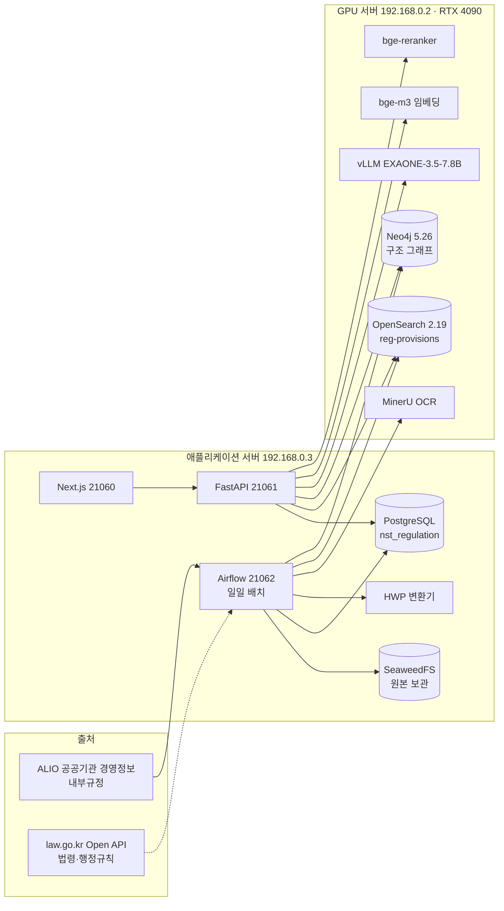

# nst-regulation — 출연연 규정·법령 서비스

국가과학기술연구회(NST)와 소관 출연연구기관 25곳의 **내부규정**과 관련 **법령**을 한곳에 모아,
조·항·호·목 단위로 구조화하고 검색·비교·질의응답을 제공하는 서비스입니다.

각 기관의 행정원과 연구자가 다음 일을 할 수 있게 하는 것이 목적입니다.

- 우리 기관 규정을 쉽게 찾는다.
- 같은 주제를 다른 기관은 어떻게 정했는지 비교해 본다.
- 근거 조문과 함께 궁금한 점에 대한 답을 받는다.

| 항목 | 값 |
|---|---|
| 서비스 | 웹 `http://192.168.0.3:21060` · API `http://192.168.0.3:21061/docs` · Airflow `:21062` |
| 운영 데이터 (2026-10-04) | 기관 26 · 규정 3,839 · 판본 11,506 · 조항 약 54만 · 검색 문서 141만 |
| 상태 | 내부 시범 운영. 로그인은 목업이고, law.go.kr 법령 적재는 API 키 승인 대기 중 |

---

## 목차

1. [주요 기능](#주요-기능)
2. [아키텍처](#아키텍처)
3. [기술 스택](#기술-스택)
4. [저장소 구조](#저장소-구조)
5. [시작하기](#시작하기)
6. [데이터 파이프라인](#데이터-파이프라인)
7. [운영](#운영)
8. [API](#api)
9. [테스트와 품질](#테스트와-품질)
10. [설정](#설정)
11. [문서](#문서)
12. [개발 규칙](#개발-규칙)

---

## 주요 기능

| 화면 | 경로 | 설명 |
|---|---|---|
| 홈 | `/` | 로그인한 사람의 기관 기준으로 현황, **다른 기관과 다른 점**, 최근 바뀐 규정을 보여 줌. 관리자는 기관별 현황 |
| 규정 찾기 | `/regulations` | 기관·주제·종류·상태 필터, 목록 / 기관별 묶기 |
| 규정 보기 | `/regulations/{id}` | 조문 본문, 참조 팝업, 개정 이력(판본 비교), 관계도(그래프), 별표·서식, **다른 기관의 같은 조항** |
| 기관 비교 | `/compare` | 주제별 항목 × 기관 비교표(우리 기관과 다른 칸 강조), 조문 나란히 보기, CSV 내보내기 |
| 규정 도우미 | `/assistant` | 검색과 질의응답을 합친 챗봇. 범위는 전체 / 기관 / 규정 / 주제. 근거는 모두 원문 그대로의 인용 |
| 검수 | `/review` | 자동 처리하지 못한 항목(참조 미연결, 구조·시행일 확인 등)의 담당 지정과 처리 |
| 법령 | `/laws` | law.go.kr 법령·행정규칙 미러 (적재 대기 중) |

- **규정 도우미의 답변 방식**
  - 기본은 일반 질문으로 보고 내용을 설명합니다.
  - 질문자가 자기 상황을 말하며 "괜찮나요/되나요"처럼 판단을 물을 때만 충족/미충족으로 답합니다.
  - 기한 판단 같은 계산은 LLM이 아니라 코드가 합니다.
- **개정 알림:** 상위 법령이 바뀌면 영향을 받는 내부규정 조항을 찾아 알리는 기능입니다. 백엔드는 구현되어 있고, 화면은 준비 중입니다.

## 아키텍처



- **원천 데이터:** PostgreSQL이 기준(source of truth)입니다. OpenSearch 색인과 Neo4j 그래프는 PostgreSQL에서 언제든 다시 만들 수 있는 파생 데이터입니다.
- **검색 색인 교체:** 새 색인을 만들어 품질 검사(gate)를 통과하면 별칭을 원자적으로 바꿉니다. 실패하면 이전 색인으로 계속 서비스합니다.
- **장애 시 동작:** GPU 서비스가 내려가도 서비스는 줄어든 기능으로 계속 동작합니다. 임베딩이 안 되면 낱말 검색만, 리랭커가 안 되면 하이브리드 점수 순, 그래프가 안 되면 DB 참조 표를 씁니다.

## 기술 스택

| 영역 | 기술 |
|---|---|
| 백엔드 | Python 3.13, uv, FastAPI, psycopg 3, Alembic(모듈별 이력), typer CLI(`reg`) |
| 웹 | Next.js 16 (App Router, `src/proxy.ts`), React 19, Tailwind CSS v4, Base UI, lucide, Pretendard |
| 배치 | Apache Airflow 3.3 (LocalExecutor), 풀 `alio_pool`·`lawgo_pool`·`gpu_pool` |
| 저장 | PostgreSQL 16 · SeaweedFS(S3 호환) · OpenSearch 2.19(nori, k-NN) · Neo4j 5.26 |
| 모델 | EXAONE-3.5-7.8B-Instruct-AWQ(vLLM) · BAAI/bge-m3(1024차원) · bge-reranker-v2-m3 · MinerU 2.5 |
| 테스트 | pytest, testcontainers(PostgreSQL·OpenSearch), respx, Playwright(화면 점검) |

## 저장소 구조

```
src/reg/
  platform/   설정, DB 연결, 저장소, LLM·임베딩·리랭커 클라이언트, 공통 유틸
  core/       수집 이후 공통 처리: 추출·파싱(조·항·호·목), 적재·계보, 참조 해석, 품질, 검수
  sources/    출처별 수집기 — alio/(내부규정), lawgo/(law.go.kr 미러)
  ocr/        MinerU OCR 연동
  index/      OpenSearch 색인(release·gate·publish), 하이브리드 검색
  search/     조문 번호 해석, 직접 조회, 자동완성, 집계
  graph/      Neo4j 투영·동기화·질의(근거 확장, 관계도, 판본 이력)
  compare/    주제 분류, 기관 비교값 추출
  qa/         질의 분석, 근거 확장, 답변 생성·검증, 규정 도우미(chat)
  alerts/     개정 영향 분석, 알림
  ops/        운영 요약·정리 작업
  api/        FastAPI 앱과 라우터
  wiring.py   출처 처리기 등록 (모듈 간 의존을 한곳에서 연결)
apps/web/     Next.js 웹
airflow/dags/ DAG 10개 (+ airflow/tests/check_dags.py)
config/       출처 설정, 주제·비교 항목(topics.yaml), 검색 동의어·사용자 사전
infra/        docker-compose(앱 서버), gpu-opensearch·gpu-neo4j·gpu-mineru·vllm-local(GPU 서버)
eval/         질의응답 평가 문항
docs/         PRD, 설계(specs)·계획(plans), 기술자료(tech), 운영(ops), 보고서(reports)
tests/        백엔드 테스트 (tests/test_architecture.py가 모듈 의존 규칙을 검사)
```

## 시작하기

### 준비물

- Python 3.13와 [uv](https://docs.astral.sh/uv/), Node.js 22, Docker
- PostgreSQL 16 (슈퍼유저 접근: DB와 역할을 처음 만들 때만 필요)
- GPU 서버 서비스: OpenSearch, Neo4j, vLLM(LLM·임베딩·리랭커), MinerU — `infra/gpu-*`, `infra/vllm-local` 참고

### 처음 설치

```bash
cp .env.example .env               # 접속 주소·비밀번호·키를 채운다 (아래 "설정")
uv sync                            # 파이썬 의존성
(cd apps/web && npm ci)            # 웹 의존성

infra/storage/gen-s3-config.sh     # SeaweedFS 인증 설정 생성
docker compose -f infra/docker-compose.yml up -d storage converter

set -a; . ./.env; set +a
uv run reg db bootstrap            # 역할(reg_migrator·reg_app)과 스키마(regulation·law·ops) — 여러 번 실행해도 안전
uv run reg db upgrade              # 마이그레이션
uv run reg bucket ensure           # 원본 보관 버킷
```

### 데이터 처음 채우기

```bash
uv run reg alio collect            # ALIO 내부규정 수집: 활성 기관 전부 (config/sources/alio.yaml, --institution KASI로 하나만)
uv run reg process --all           # 추출·파싱·적재·참조 해석 (여러 작업자를 동시에 돌려도 된다)
uv run reg refs reresolve --all    # 참조 재해석 (적재 순서 때문에 못 이은 참조)
uv run reg annex render            # 별표 이미지
uv run reg graph rebuild           # Neo4j 그래프
uv run reg index build             # 검색 색인 생성 → 품질 검사 → 게시
uv run reg topics classify --all   # 주제 분류
uv run reg compare build           # 기관 비교값
```

### 실행

```bash
bash scripts/run-dev.sh            # 웹 빌드 → API(21061)·웹(21060) 재시작 (빌드 실패 시 기존 서비스 유지)
bash scripts/airflow.sh build      # Airflow 이미지 (src를 이미지에 넣으므로 코드가 바뀌면 다시 빌드)
bash scripts/airflow.sh up
bash scripts/airflow.sh check      # DAG 10개 점검
```

로그와 PID는 `.run/`에 남습니다. 웹은 목업 로그인을 거칩니다(`/login`, 계정을 고르면 그 기관이 "우리 기관"이 됨).

## 데이터 파이프라인

```
수집 → 원본 보관 → 변환·텍스트 추출(필요하면 OCR) → 파싱(조·항·호·목·별표·부칙) → 적재·계보(판본 비교)
     → 참조 해석 → [게시] 그래프 동기화 · 검색 색인 · 주제 분류 · 기관 비교값 · 개정 영향 분석
```

| 단계 | 핵심 | 명령 / DAG |
|---|---|---|
| 수집 | ALIO 목록·상세·첨부, 지문(fingerprint)으로 바뀐 것만, 폐지 감지 | `reg alio collect` · `reg_alio_daily` (매일 02:00) |
| 법령 | 현행만, 필요한 법령만(설정 + 규정이 인용한 법령 + 시행령·규칙), 별표서식 HTML·PDF | `reg law full` · `reg law targets` · `reg_law_*` (키 승인 전까지 일시정지) |
| 처리 | 같은 규정의 이벤트를 묶어 처리, 규정 단위 잠금, 실패는 재시도 후 보류 | `reg process` · `reg_process` |
| OCR | 글자 층이 없거나 깨진 PDF → MinerU | `reg ocr` · `reg_ocr` (`gpu_pool`) |
| 게시 | 그래프 동기화 → 영향 분석 / 색인 생성·검사·게시 → 주제 분류 → 비교값 | `reg_publish` |
| 정리 | 오래된 색인·로그 정리, 하루 요약 | `reg_maintenance`, `reg_notify` |

- **전체 재파싱:** 파서를 바꾼 뒤 전체를 다시 파싱할 때는 `reg process --rebuild`를 씁니다. 원본과 OCR 결과는 그대로 두고 구조 테이블만 다시 만듭니다. 사람이 내린 검수 결정은 `regulation.review_decision`에 남아 있다가 다시 적용됩니다.

자세한 내용은 [docs/tech/02-data-loading.md](docs/tech/02-data-loading.md)에 있습니다.

## 운영

| 할 일 | 명령 |
|---|---|
| 서비스 재시작 | `bash scripts/run-dev.sh` |
| 상태 확인 | `curl :21061/api/v1/institutions` (API·DB) · Airflow UI `:21062` · `bash scripts/airflow.sh check` · `.run/*.log` |
| 색인 다시 만들기 | `uv run reg index build` (변화가 없으면 건너뜀, `--force`로 강제) |
| 그래프 다시 만들기 | `uv run reg graph rebuild` (약 3분) |
| 품질 지표 | `uv run reg quality report` |
| 질의응답 평가 | `uv run reg eval qa --no-log --out <파일>` (읽기 전용) |

- **GPU 서버 기동 순서:** `vllm-llm`을 MinerU보다 **먼저** 띄웁니다. 순서가 바뀌면 GPU 메모리가 모자라 LLM이 뜨지 않습니다.
- **GPU 서비스가 느리거나 멈출 때:** LLM 생성이 15 tok/s 이하로 떨어지거나 리랭커가 응답하지 않으면 해당 컨테이너만 재시작합니다. 절차는 [docs/tech/05-services-infra-e2e.md §8](docs/tech/05-services-infra-e2e.md)에 있습니다.
- **GPU를 오래 쓰는 작업은 서비스 시간에 돌리지 않습니다.** 대상은 별표 표 변환(`reg annex tables`)과 비교값 생성(`reg compare build`)입니다.
- **장애 대응 문서:** [docs/ops/airflow.md](docs/ops/airflow.md)

## API

OpenAPI 문서는 `http://192.168.0.3:21061/docs`에 있습니다. 자주 쓰는 엔드포인트는 다음과 같습니다.

| 메서드 | 경로 | 용도 |
|---|---|---|
| GET | `/api/v1/home?inst=` | 홈(기관 현황·최근 개정·주제) |
| GET | `/api/v1/regulations?q=&inst=&topic=&kind=&status=` | 규정 목록·필터·집계 |
| GET | `/api/v1/hsearch?q=` · `/api/v1/search/lookup` · `/api/v1/search/suggest` | 조항 검색 · 조문 번호 조회 · 자동완성 |
| GET | `/api/v1/provision/similar?pv=` | 다른 기관의 같은 조항 (의미 검색) |
| GET | `/api/v1/topics` · `/api/v1/compare?topic=&inst=` · `/api/v1/compare/divergences?inst=` | 주제 · 기관 비교표 · 다른 점 |
| POST | `/api/v1/chat` | 규정 도우미 (SSE 스트리밍, `?stream=false`면 JSON) |
| POST | `/api/v1/qa` | 단건 질의응답 (호환용) |
| GET | `/api/v1/graph/neighborhood?pv=` · `/lineage?pv=` | 관계도 · 판본 이력 |
| GET/POST | `/api/v1/review-tasks` · `/{id}/assign`·`resolve`·`dismiss`·`hold`·`reopen` | 검수 |

## 테스트와 품질

```bash
uv run pytest -q                   # 전체 (testcontainers로 PostgreSQL·OpenSearch를 띄운다, 약 20분)
uv run pytest tests/test_architecture.py   # 모듈 의존 규칙
uv run ruff check src
(cd apps/web && npx tsc --noEmit && npx eslint src && npm run build)
```

| 지표 (2026-10-04) | 값 |
|---|---|
| 백엔드 테스트 | 976 통과 |
| 질의응답 (20문항) | 상태 1.0 · 인용 정확도 0.938 · 판단 정확도 1.0 · 일반 질문 1.0 · p95 2.1초 |
| 조문 번호 조회 점검 | 9/9 1위 · 검색 p95 0.3초 |
| 주제 분류 표본 정확도 | 0.93–0.95 |
| 기관 비교값 | 525칸 중 329칸에 값, 표본 정확도 약 0.9 (모든 값에 원문 인용) |

## 설정

모든 설정은 환경 변수(`.env`, 접두어 `REG_`)로 주입합니다. 견본은 `.env.example`에 있습니다. **`.env`는 커밋하지 않습니다.**

| 변수 | 설명 |
|---|---|
| `REG_DATABASE_URL` · `REG_MIGRATOR_URL` | 앱 계정(데이터 읽기·쓰기) · 마이그레이션 계정 |
| `REG_OS_URL` | OpenSearch (계정 포함) |
| `REG_NEO4J_URL` · `REG_NEO4J_PASSWORD` | Neo4j |
| `REG_LLM_URL` · `REG_EMBED_URL` · `REG_RERANK_URL` (+ `_MODEL`) | vLLM 서비스 |
| `REG_MINERU_URL` · `REG_MINERU_API_KEY` | OCR |
| `REG_S3_*` | 원본 보관소 |
| `REG_LAWGO_OC` | law.go.kr Open API 인증키 |
| `REG_AIRFLOW_*` | Airflow 메타DB·키·관리자 |
| `*_DOCKER` | 컨테이너 안에서 쓰는 주소 |

파일로 관리하는 설정은 다음과 같습니다.
- `config/sources/alio.yaml`: 수집 기관
- `config/sources/lawgo.yaml`: 법령 범위
- `config/topics.yaml`: 주제와 비교 항목
- `config/search_*.txt`: 검색 동의어와 사용자 사전

## 문서

| 문서 | 내용 |
|---|---|
| [docs/tech/00-overview.md](docs/tech/00-overview.md) | 기술자료 목차와 시스템 구성 |
| [02-data-loading](docs/tech/02-data-loading.md) · [03-rdb](docs/tech/03-rdb.md) · [04-search-graph](docs/tech/04-search-graph.md) · [05-services-infra-e2e](docs/tech/05-services-infra-e2e.md) · [06-service-ui](docs/tech/06-service-ui.md) | 적재 · DB · 검색·그래프 · 서비스·인프라·E2E · 화면 |
| [docs/PRD.md](docs/PRD.md) | 제품 요구사항 |
| [docs/superpowers/specs/](docs/superpowers/specs/) | 설계 문서 |
| [docs/superpowers/plans/](docs/superpowers/plans/) | 구현 계획 |
| [docs/ops/airflow.md](docs/ops/airflow.md) | Airflow 운영 |

## 개발 규칙

- **브랜치:** 기능마다 `feat/*` 브랜치에서 작업하고 `feat/m6-integration`에서 합쳐 검증한 뒤 `main`에 병합합니다.
- **모듈 경계:** 의존 방향은 `tests/test_architecture.py`가 강제합니다. 예를 들어 `qa`는 `graph`를 직접 가져오지 않고 API 계층에서 주입받습니다.
- **마이그레이션:** 모듈별 Alembic 이력(core·alio·lawgo)을 씁니다. 실서버 적용은 `reg db upgrade`로 합니다.
- **화면:** NAIS 디자인 시스템(방향 A "차분한 연구 도구")을 따릅니다. 금지 목록은 [디자인 스펙](docs/superpowers/specs/2026-10-03-service-ui-redesign.md) §0에 있습니다.
- **비밀값:** 코드·문서·로그에 넣지 않습니다. `.env`만 씁니다.
